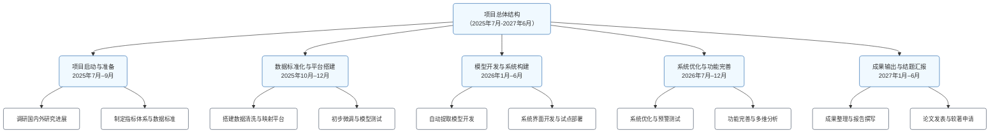

```mermaid
flowchart TB
    %% === 顶层架构 ===
    A[项目总体结构<br>（2025年7月-2027年6月）]

    A --> B1[项目启动与准备<br>2025年7月–9月]
    A --> B2[数据标准化与平台搭建<br>2025年10月–12月]
    A --> B3[模型开发与系统构建<br>2026年1月–6月]
    A --> B4[系统优化与功能完善<br>2026年7月–12月]
    A --> B5[成果输出与结题汇报<br>2027年1月–6月]

    %% === 子模块任务 ===
    B1 --> C1[调研国内外研究进展]
    B1 --> C2[制定指标体系与数据标准]

    B2 --> C3[搭建数据清洗与映射平台]
    B2 --> C4[初步微调与模型测试]

    B3 --> C5[自动提取模型开发]
    B3 --> C6[系统界面开发与试点部署]

    B4 --> C7[系统优化与预警测试]
    B4 --> C8[功能完善与多维分析]

    B5 --> C9[成果整理与报告撰写]
    B5 --> C10[论文发表与软著申请]

    %% === 样式设置 ===
    classDef stage fill:#f0f9ff,stroke:#2b6cb0,stroke-width:1px,rx:6,ry:6,font-size:14px
    classDef task fill:#ffffff,stroke:#4a5568,stroke-width:1px,rx:4,ry:4,font-size:13px
    class A stage
    class B1,B2,B3,B4,B5 stage
    class C1,C2,C3,C4,C5,C6,C7,C8,C9,C10 task

```