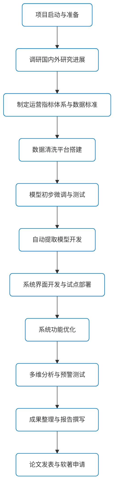

```mermaid
flowchart TD
    %% === 顶层任务 ===
    A[项目启动与准备]
    A --> B1[调研国内外研究进展]
    B1 --> B2[制定运营指标体系与数据标准]

    B2 --> C1[数据清洗平台搭建]
    C1 --> C2[模型初步微调与测试]

    C2 --> D1[自动提取模型开发]
    D1 --> D2[系统界面开发与试点部署]

    D2 --> E1[系统功能优化]
    E1 --> E2[多维分析与预警测试]

    E2 --> F1[成果整理与报告撰写]
    F1 --> F2[论文发表与软著申请]

    %% === 样式设置 ===
    classDef nodeStyle fill:#ffffff,stroke:#007acc,stroke-width:1.2px,rx:6px,ry:6px,font-size:14px
    class A,B1,B2,C1,C2,D1,D2,E1,E2,F1,F2 nodeStyle

```