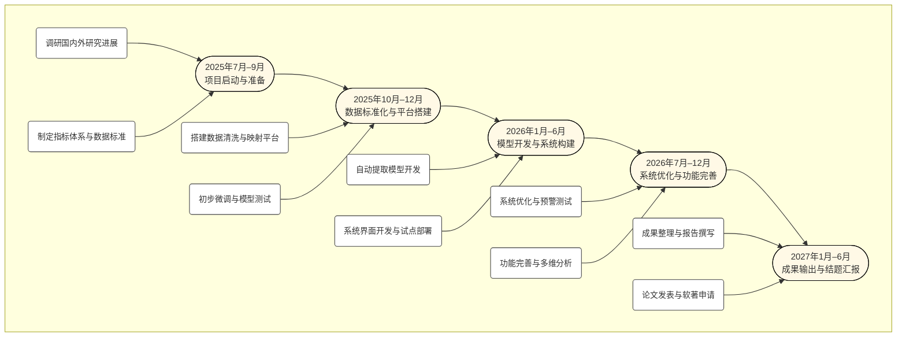

```mermaid
flowchart TD
    %% === 项目主阶段 ===
    A1([2025年7月–9月<br>项目启动与准备]) --> A2([2025年10月–12月<br>数据标准化与平台搭建])
    A2 --> A3([2026年1月–6月<br>模型开发与系统构建])
    A3 --> A4([2026年7月–12月<br>系统优化与功能完善])
    A4 --> A5([2027年1月–6月<br>成果输出与结题汇报])

    %% === 子任务细节 ===
    subgraph S1 [ ]
        B1(调研国内外研究进展) --> A1
        B2(制定指标体系与数据标准) --> A1

        B3(搭建数据清洗与映射平台) --> A2
        B4(初步微调与模型测试) --> A2

        B5(自动提取模型开发) --> A3
        B6(系统界面开发与试点部署) --> A3

        B7(系统优化与预警测试) --> A4
        B8(功能完善与多维分析) --> A4

        B9(成果整理与报告撰写) --> A5
        B10(论文发表与软著申请) --> A5
    end

    %% === 样式设置 ===
    classDef mainStage fill:#fff9e6,stroke:#000,stroke-width:1px,rx:8px,ry:8px,font-size:14px
    classDef subTask fill:#ffffff,stroke:#444,stroke-width:1px,rx:4px,ry:4px,font-size:13px
    class A1,A2,A3,A4,A5 mainStage
    class B1,B2,B3,B4,B5,B6,B7,B8,B9,B10 subTask

```