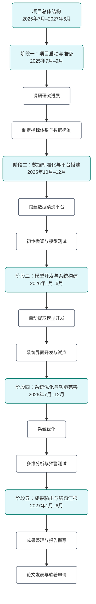

```mermaid
flowchart TD
    %% === 总体项目节点 ===
    A[项目总体结构<br>2025年7月–2027年6月]

    %% === 阶段一 ===
    A --> B1[阶段一：项目启动与准备<br>2025年7月–9月]
    B1 --> C1[调研研究进展]
    C1 --> C2[制定指标体系与数据标准]

    %% === 阶段二 ===
    C2 --> B2[阶段二：数据标准化与平台搭建<br>2025年10月–12月]
    B2 --> C3[搭建数据清洗平台]
    C3 --> C4[初步微调与模型测试]

    %% === 阶段三 ===
    C4 --> B3[阶段三：模型开发与系统构建<br>2026年1月–6月]
    B3 --> C5[自动提取模型开发]
    C5 --> C6[系统界面开发与试点]

    %% === 阶段四 ===
    C6 --> B4[阶段四：系统优化与功能完善<br>2026年7月–12月]
    B4 --> C7[系统优化]
    C7 --> C8[多维分析与预警测试]

    %% === 阶段五 ===
    C8 --> B5[阶段五：成果输出与结题汇报<br>2027年1月–6月]
    B5 --> C9[成果整理与报告撰写]
    C9 --> C10[论文发表与软著申请]

    %% === 样式定义 ===
    classDef stage fill:#e0f7fa,stroke:#00796b,stroke-width:1px,rx:6px,ry:6px,font-size:14px
    classDef task fill:#ffffff,stroke:#4a5568,stroke-width:1px,rx:4px,ry:4px,font-size:13px
    class A,B1,B2,B3,B4,B5 stage
    class C1,C2,C3,C4,C5,C6,C7,C8,C9,C10 task

```